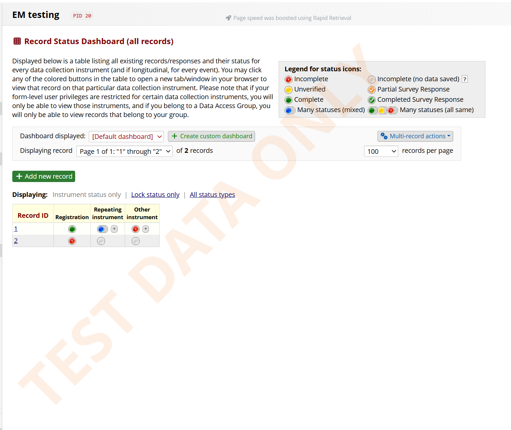
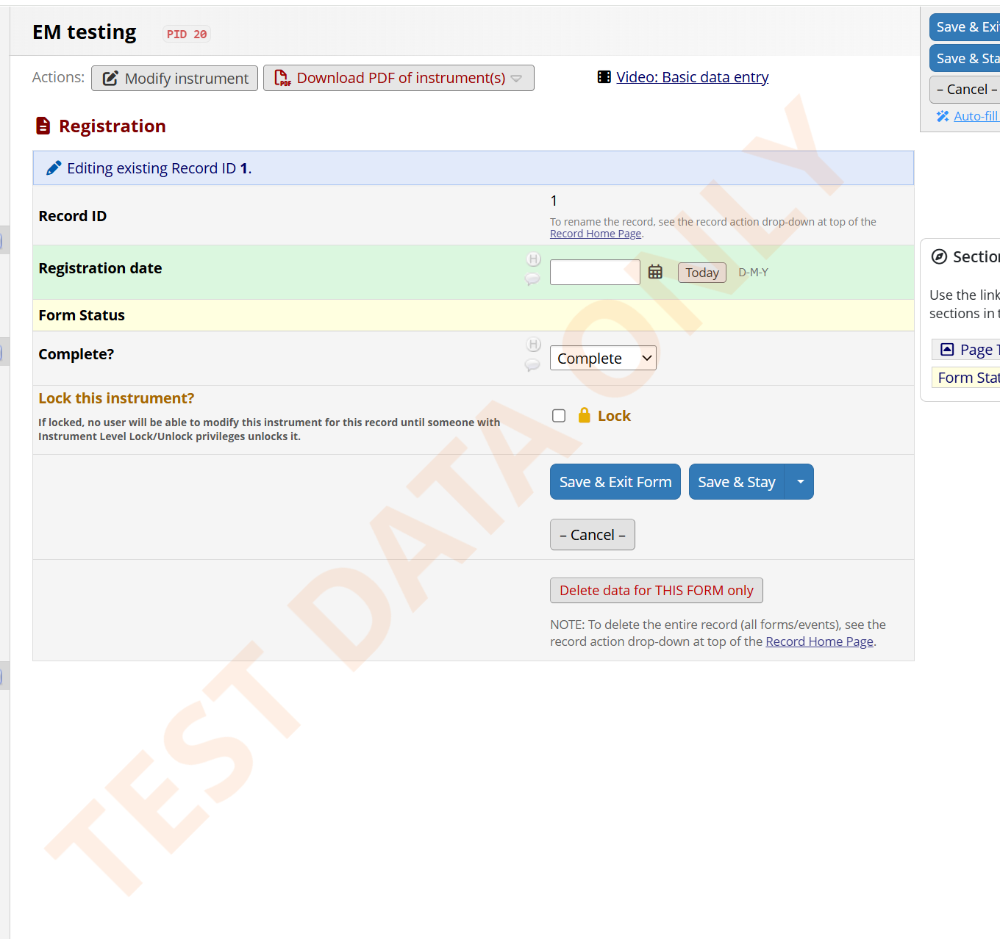
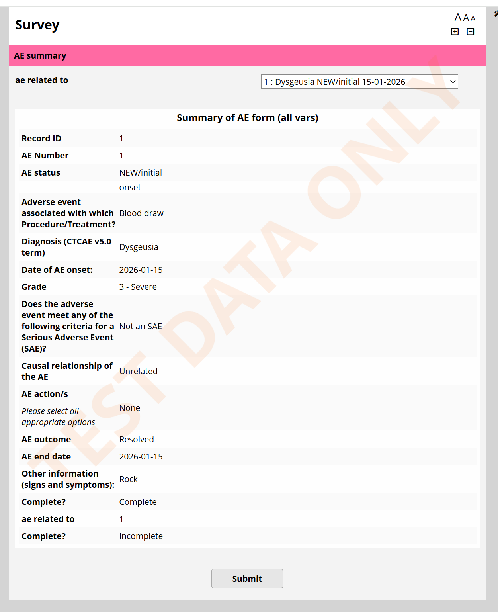

# Watermark for Development Databases
A REDCap module to display a watermark on selected pages of a project in Development, to alert users that it is a training or other non-production project. This module is designed to be enabled at the system or project-level where it is needed. It was created to reduce the risk of data entry in training projects that look and behave like the production project.

## Prerequisites
- REDCap >= 14.1.6 (needed for Control Center settings that projects can override)
- REDCap Module Framework version 16

## Easy installation
- Install the Watermark for Development Databases module from the Consortium [REDCap Repo](https://redcap.vanderbilt.edu/consortium/modules/index.php) from the control center.
- Go to **Control Center > External Modules**, enable Watermark for Development Databases.

## Manual Installation
- Clone this repo into to `<redcap-root>/modules/watermark_for_develpment_databases_v1.1.0`.
- Go to **Control Center > External Modules**, enable Watermark for Development Databases.

## Configuration
Admins set the site-wide values in **Control Center > External Modules > Watermark for Development Databases > Configure**. When project overrides are allowed, projects see the same settings, pre-filled with the site values, in **Project Home > External Modules > Configure**.

| Setting | Default | Min – max and limitations |
|---|---|---|
| **Enable module on all projects by default** (REDCap built-in) | Off | Off: the module must be enabled on each project. |
| ↳ **Apply watermark to** | All projects | Only shown when the box above is ticked. **New projects only** = projects created after this is saved. |
| **Allow project-level settings to override these defaults** | On | Off: all projects use the site values and non-admins don't see the project Configure button. |
| **Watermark text** | `TEST DATA ONLY` | Blank falls back to the default. Projects need at least the minimum number of letters or digits (see below). |
| **Watermark colour** | `#F26600` (orange) | Colour picker. Transparency in the picker is ignored; use opacity instead. |
| **Colour code** | blank | Optional; overrides the picker. Hex (`#F26600`, `#C00`) or `rgb(242,102,0)`. Typing a code updates the picker, and choosing in the picker fills in the code. |
| **Watermark opacity** | `0.1` | 0.1 – 1.0. Projects can't go below the project minimum. |
| **Watermark text size** | `90` pt | 10 – 300 pt (projects: project minimum – 300). Shrinks automatically on small screens so it stays on screen. |
| **Fewest letters or digits in project text** | `4` | 1 – 50. Spaces, punctuation and invisible characters don't count. |
| **Smallest text size projects can choose** | `48` pt | 10 – 300. |
| **Lowest opacity projects can choose** | `0.1` | 0.1 – 1.0. |
| **Increase opacity as a development project fills up** | Off | Opacity rises evenly between the two record counts below, up to 5 × the project's opacity (max 1.0). e.g. 0.1 → 0.3 at 25 records → 0.5 at 30. |
| ↳ **Start increasing at** | `20` records | Whole number. |
| ↳ **Reach maximum at** | `30` records | Whole number, greater than the start. Set to your site's development record limit. |

**Project overrides**
- A project value left the same as the site value isn't stored, so the project keeps following the site if an admin changes it.
- The project limits (letters, text size, opacity) only apply to values a project changes; site values are always accepted. Problems are flagged as you type, and saving is blocked until they're fixed.
- Very light colours (white, pale greys, yellow, cyan, lime) can't be chosen by projects, and aren't shown on data entry or dashboard pages; surveys allow site colours that are very light.
- Colour order: project code → project picker → site code → site picker → orange.
- Invalid or blank values fall back to the site value, then the built-in default, so the watermark always appears.

**New projects only**
- REDCap still lists the module as "Enabled for All Projects" on every project; a module can't change that list.
- Projects created before the cut-off get a **Show the watermark on this project** checkbox in their Configure dialog (pre-ticked until they save a choice). Projects nobody opens stay off.
- Projects where the module is enabled on the project itself always show the watermark.

**Upgrading from v1.0.0:** values projects saved under v1.0.0 (e.g. opacity `0.2`) stay as project overrides.

## Development and Production, and specific pages
The watermark is visible on specific pages when a database is in Development status, but is not visible once the project is moved to Production or Analysis/Cleanup status.

The watermark is visible on:
- Record Status Dashboard
- Add/Edit Records page
- Data entry pages/forms
- Survey Distribution Tools
- Surveys

It is not visible on:
- Setup
- Designer pages
- Dictionary
- Codebook
- Application pages

## Examples
In Development status, the watermark looks like this:

- Record Status Dashboard:

- Data Entry Form:

- Survey

## AI assistance
Development of this project has made extensive use of AI assistance. AI tools, primarily Claude Pro, have been used throughout the development process, including for discussion and refinement of design and architecture, implementation and refactoring of code, debugging and review, and preparation and revision of documentation.

The extent and nature of this assistance vary across the project and are not attributed to individual commits. AI-generated suggestions and contributions are reviewed, adapted, and integrated as part of the normal development process.

Responsibility for the design, implementation, maintenance, and released software remains entirely with the project maintainer.

## Acknowledgments
Many thanks to Chesny et al whose [Project Overlay Banner](https://github.com/ctsit/project_overlay_banner) module provided inspiration for this module.
